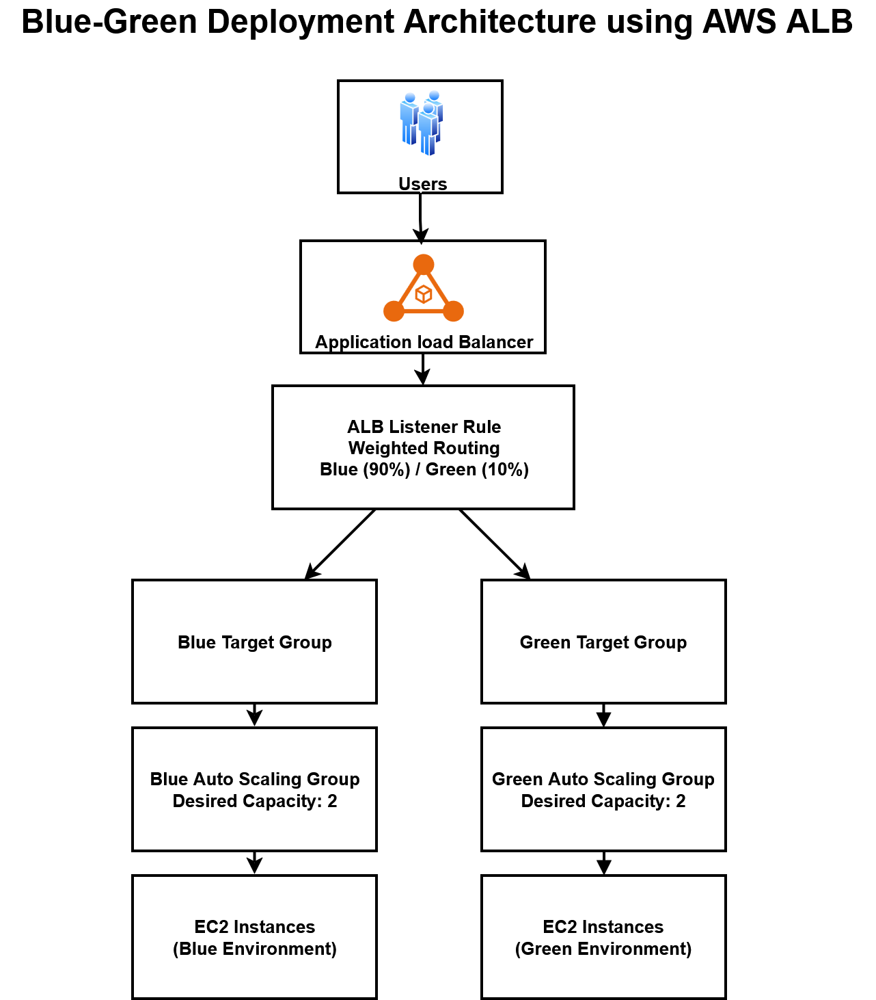
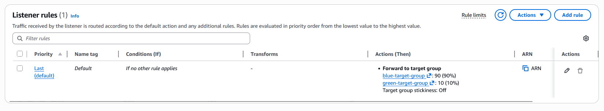
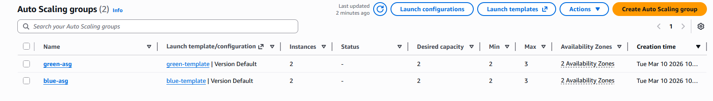
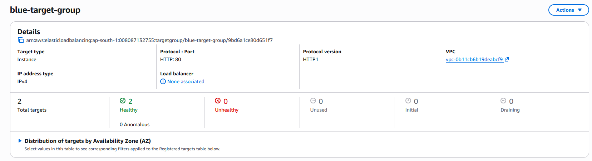
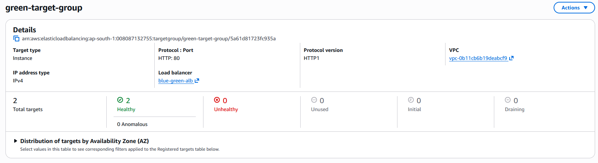
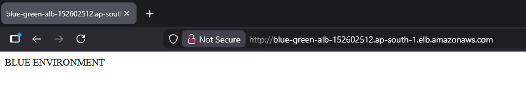
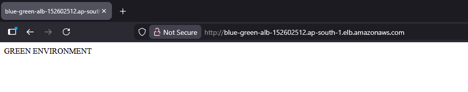

# AWS Blue-Green Deployment using Application Load Balancer

This project demonstrates how to implement a **Blue-Green deployment strategy on AWS** using an **Application Load Balancer (ALB), Target Groups, and Auto Scaling Groups**.

The setup allows safe deployment of new application versions by gradually shifting traffic between environments.

---

## Architecture

Users access the application through an **Application Load Balancer**, which routes traffic based on a **weighted listener rule**.

---

## Components Used

* **Application Load Balancer (ALB)** – distributes incoming traffic
* **Listener Rule with Weighted Routing** – controls traffic split between environments
* **Target Groups** – route requests to backend instances
* **Auto Scaling Groups (ASG)** – maintain desired number of EC2 instances
* **EC2 Instances** – host the application environments

---

## Deployment Flow

1. **Blue environment** initially serves all production traffic.
2. A new version of the application is deployed to the **Green environment**.
3. The ALB listener rule sends **90% of traffic to Blue and 10% to Green**.
4. If the new version works correctly, traffic can gradually shift to **100% Green**.
5. If issues occur, traffic can instantly **roll back to Blue**.

This approach ensures **zero downtime deployments and safer releases**.

---

## Weighted Routing Example

The ALB listener rule forwards requests based on configured traffic weights.

---

## Auto Scaling Infrastructure

Both environments use **Auto Scaling Groups** to maintain high availability.

---

## Target Group Health Checks

### Blue Target Group

### Green Target Group

Target groups ensure only **healthy instances receive traffic**.

---

## Application Responses

### Blue Environment

### Green Environment

---

## Key Concepts Demonstrated

* Blue-Green Deployment
* Canary Deployment using weighted routing
* High availability with Auto Scaling Groups
* Health monitoring using Target Groups
* Safe rollback strategy

---

## Tools & Services

* AWS EC2
* AWS Application Load Balancer
* AWS Target Groups
* AWS Auto Scaling
* Amazon Linux
* Apache Web Server
